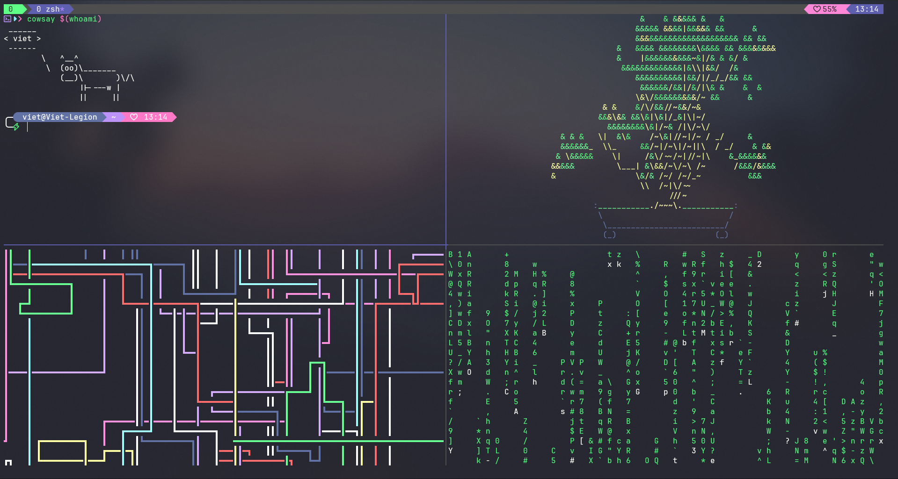

# Auto Setup Linux Terminal
This script automates setup of my Linux Terminal

## Table of Contents
- [Auto Setup Linux Terminal](#auto-setup-linux-terminal)
  - [Table of Contents](#table-of-contents)
  - [Preview](#preview)
    - [Screenshots](#screenshots)
  - [Important Notes](#important-notes)
  - [Installation](#installation)

## Preview
### Screenshots



## Important Notes
> [!IMPORTANT]
> Make sure you used **Nerd Fonts**

> [!IMPORTANT]
> Install a backup tool and create a system backup before using this script.

> [!NOTE]
> This script does not include package uninstallation, as some packages may already exist on your system by default. Creating an uninstallation script could potentially affect your current setup.

> [!NOTE]
> This is my dotfiles repo: [`dotfiles`](https://github.com/ViegPhunt/Dotfiles)

## Installation
Just use this line in your terminal:
```
bash -c "$(curl -fSL https://raw.githubusercontent.com/ViegPhunt/auto-setup-LT/main/install.sh)"
```